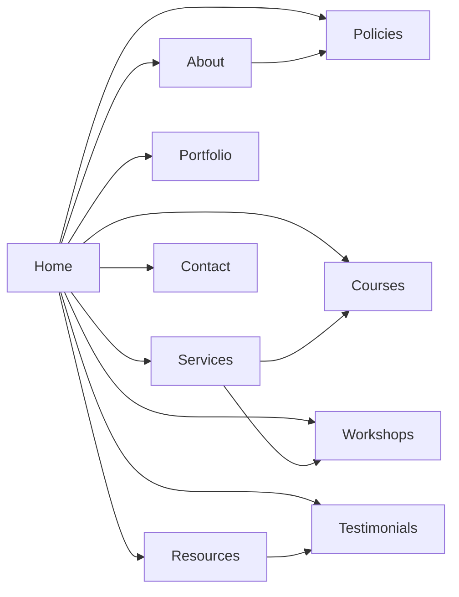

# Executive Summary  

We will design **The Scholar Edge** as a full multi-page responsive website addressing the needs of students, scholars, and academicians seeking research support and data analytics training.  Based on the existing single-page content, the new site will include a clear **sitemap** (Home, About, Services, Courses, Workshops, Portfolio, Resources/Blogs, Contact, Testimonials, Policies) and a responsive **navigation bar** (sticky header, mobile “hamburger” menu) for easy access.  The UI will use an education-appropriate color palette (e.g. bright accent colors like yellow, blue or red paired with neutral backgrounds), legible typography (16px+ body text), and consistent spacing.  Key components include a hero section, service/course cards, portfolio gallery, CTA buttons (WhatsApp and Discord), testimonial carousel, and a contact form.  We’ll use **HTML5, CSS3 (Bootstrap 5)**, and vanilla JS (optionally React/Vue) to build the site, assuming a static deliverable (no login/logout).  Deliverables will be complete HTML/CSS/JS source files, SVG icons, a README (build/deploy/test), and deployment guidance (e.g. GitHub Pages or Netlify).  The design will meet accessibility (WCAG) standards (contrast ≥4.5:1, ARIA roles) and be tested across browsers and breakpoints (mobile-first).  Below is a detailed breakdown of pages, components, and implementation guidance.

## Sitemap & URL Structure  

| **Page**            | **URL Path**           | **Key Sections (Content Placeholder)**                                                                                                 | **SEO Meta Title / Description**                                       |
|---------------------|------------------------|---------------------------------------------------------------------------------------------------------------------------------------|------------------------------------------------------------------------|
| **Home**            | `/` or `/index.html`   | Hero banner (tagline, background image, “Book Consultation” and “Learn With Us” CTAs), About blurb, “What We Offer” icons, services overview, testimonial carousel, WhatsApp & Discord CTAs, footer with quick links. | *Title:* “The Scholar Edge – Research Support & Data Analytics Training”<br>*Desc:* “Empowering students and researchers with 25+ years of expertise in thesis writing, data analysis training, and end-to-end research support.” |
| **About**           | `/about.html`          | Mission statement, history, founder bio, academic journey stats, reasons to trust (mentorship, experience, tool mastery), FAQ (confidentiality, plagiarism, delivery). | *Title:* “About The Scholar Edge – Experienced Academic Support”<br>*Desc:* “Learn about The Scholar Edge’s mission and 25+ years of experience guiding scholars through thesis writing, data analysis, and publication.” |
| **Services**        | `/services.html`       | Overview of services: Thesis & Dissertation Support (synopsis, lit review, methodology, data analysis, journal publication, plagiarism check), Data Analytics Training (SPSS, SmartPLS, R, Python, Excel, Power BI, Tableau), Research Consulting (statistical analysis, design, mentoring). Include service cards with icons and brief descriptions. | *Title:* “Our Services – Thesis Support & Data Analytics | The Scholar Edge”<br>*Desc:* “Discover our thesis/dissertation support, data analytics courses (SPSS, R, Python, etc.), and research consulting to advance your academic work.” |
| **Courses**         | `/courses.html`        | Detailed course catalog & schedule: descriptions for each training program (SPSS, Python, Tableau, etc.), format (live, recorded, one-on-one), pricing tiers (if any) or enrollment CTA. Maybe reuse “Our Services” info. | *Title:* “Courses & Training – SPSS, Python, Tableau | The Scholar Edge”<br>*Desc:* “Enroll in our online data analytics courses (SPSS, Python, Power BI, Tableau, etc.) taught by expert instructors. Flexible live & recorded formats available.” |
| **Workshops**       | `/workshops.html`      | List of upcoming or past workshops (topics, dates, brief summaries). Possibly reuse content from “Our Workshops” if available, or testimonials from workshop attendees. | *Title:* “Workshops – Research & Analytics Seminars | The Scholar Edge”<br>*Desc:* “Attend our interactive research and analytics workshops. Learn SPSS, SmartPLS, and research methodology hands-on with expert guidance.” |
| **Portfolio**       | `/portfolio.html`      | Showcase of past projects or success stories: e.g. thesis titles, sample data analysis outputs, or client logos (with permission). Could include a gallery of student works or case studies. | *Title:* “Portfolio – Our Work & Success Stories | The Scholar Edge”<br>*Desc:* “Explore examples of our past projects and the success stories of students and scholars we have supported, from thesis writing to data analysis.” |
| **Resources**       | `/resources.html`      | Blog/news section with articles and guides (SEO-optimized) on research methods, statistics tips, data analytics tutorials. Use snippet previews. Possibly “Resources” combines Blog. | *Title:* “Resources & Blog – Research Tips & Analytics | The Scholar Edge”<br>*Desc:* “Read our latest blog posts and resources on research methodology, SPSS tips, Python for analytics, and academic publishing advice.” |
| **Testimonials**    | `/testimonials.html`   | Carousel or grid of student testimonials (quotes, names, roles). Include photos/icons. May integrate with homepage testimonials section for consistency. | *Title:* “Testimonials – Student & Scholar Feedback | The Scholar Edge”<br>*Desc:* “Hear from our students and PhD scholars about how The Scholar Edge helped them with thesis writing, SPSS training, and research success.” |
| **Contact**         | `/contact.html`        | Contact form (name, email, subject, message), contact details (phone WhatsApp +91 8685099555, email), office address, embedded map (if applicable), social links. Include the WhatsApp floating CTA on every page. | *Title:* “Contact Us – Get Research Help | The Scholar Edge”<br>*Desc:* “Get in touch with The Scholar Edge for research support or training. Chat on WhatsApp (+918685099555) or send us a message.” |
| **Policies**        | `/privacy.html`, `/terms.html`, etc. | Privacy Policy, Refund Policy, Terms & Conditions, Disclaimer – content outlining site policies. (SEO meta for each page accordingly). | *Title:* “Privacy Policy – The Scholar Edge” (and similar for Terms, Refund, etc.)<br>*Desc:* Standard description about data protection and site policies. |

To visualize the site structure, consider a sitemap diagram:



## Navigation & Header  

- **Navbar Layout:** Use a responsive navbar (e.g. Bootstrap’s **`.navbar-expand-lg`** for mobile collapse) that displays the brand/logo on the left and menu links on the right. On mobile, a hamburger button toggles the menu (ensure it has `aria-label="Toggle navigation"`). Use **`fixed-top`** or **`sticky-top`** positioning so the header stays visible on scroll; apply top margin or padding to `body` to prevent content overlap.  
- **Menu Items:** Include links: Home, About, Services, Courses, Workshops, Portfolio, Resources/Blog, Testimonials, Contact. Ensure the logo or brand name links to Home. Use **`<button type="button" class="navbar-toggler" ...>`** for the toggle (per Bootstrap) and place menu items in a **`<ul class="navbar-nav ms-auto">`** (right-aligned). Always include **`role="navigation"`** and ARIA labels on toggler for accessibility.  
- **Responsive Behavior:** At small widths, collapse the menu into the hamburger to avoid overlap. For fixed/sticky headers, add equivalent top margin to the main content or use Bootstrap’s built-in spacing utilities to offset it (Bootstrap docs note that a fixed navbar can overlay content unless compensating padding is added).  
- **Accessibility:** Use semantic `<button>` for the toggler (as MDN recommends) and include `aria-expanded` attributes. Ensure link texts are descriptive, and the focus outline is visible (use `.focus-ring` or default).

### Sample Navbar Code (Bootstrap 5)

```html
<nav class="navbar navbar-expand-lg navbar-light bg-light fixed-top">
  <div class="container">
    <a class="navbar-brand" href="/">The Scholar Edge</a>
    <button class="navbar-toggler" type="button" data-bs-toggle="collapse"
            data-bs-target="#navbarNav" aria-controls="navbarNav"
            aria-expanded="false" aria-label="Toggle navigation">
      <span class="navbar-toggler-icon"></span>
    </button>
    <div class="collapse navbar-collapse" id="navbarNav">
      <ul class="navbar-nav ms-auto">
        <li class="nav-item"><a class="nav-link" href="/">Home</a></li>
        <li class="nav-item"><a class="nav-link" href="/about.html">About</a></li>
        <!-- more nav items -->
      </ul>
    </div>
  </div>
</nav>
```

## UI/UX Design  

- **Color Palette:** Choose a palette fitting an educational theme. Studies show education brands often favor *yellow, blue, red* as accent colors. For example, a clean white or light gray background (common in university sites) with a bright **primary color** (e.g. golden yellow or deep blue) for headers/CTAs, and a contrasting **secondary color** for highlights. Maintain high contrast (WCAG AA: ≥4.5:1 for text) – e.g. dark text on light background, white text on colored buttons. Use 2–3 primary colors (each page headline area could use a bold accent) and neutral backgrounds to avoid overwhelming the user.  
- **Typography:** Use a sans-serif font (e.g. Roboto or Lato) for readability. Set **body text ≥16px** (as USWDS recommends). Headings (H1–H3) should scale logically (e.g. 32px H1, 24px H2, 18px H3), ensuring clear hierarchy. Line height should be about 1.5 for paragraphs. Keep line length ~50–70 characters (responsive container widths) to aid readability. Align text left; avoid justified text blocks. Use a consistent type scale (e.g. 8pt or 10pt modular scale) to space headings, body, and captions.  
- **Spacing & Layout:** Employ a consistent spacing system (e.g. 8px or 10px increments) around elements. Use ample vertical white-space (margin/padding) to separate sections (hero, services, footer). Containers should be centered with max-width (Bootstrap containers or CSS grids) so lines don’t span too wide. Follow a mobile-first grid: stack content in one column on narrow screens and use multi-column (2–3 columns) at breakpoints≥768px for service cards or portfolio items.  
- **Breakpoints:** Use a mobile-first approach: define styles for smallest screens, then add media queries at Bootstrap’s default breakpoints: *sm (576px)*, *md (768px)*, *lg (992px)*, *xl (1200px)*. At **576px**, switch from stacked to multi-column (`col-sm-`); at **768px**, adapt navigation and larger card layouts; above **992px**, show full-width layouts. A responsive grid (12-columns) will adapt content fluidly.  
- **Components:** Use Bootstrap’s component styles where possible (cards for services, modals for Discord invite, carousel for testimonials). Use **SVG icons** for visual clarity (scale without blurring). Ensure all buttons have sufficient padding and visible hover/focus states. Maintain contrast on interactive elements (buttons, links) at all states (normal/hover/active). Provide `alt` text for images (e.g. hero background decorative: `aria-hidden="true"` or empty alt). All colors and interactions should be WCAG 2.1 AA compliant.

### Accessible Design Notes  

- Adhere to **ARIA** guidelines: use `<button>` for clickable controls (avoid divs with `role="button"` if possible). Label form fields clearly and associate with `<label>` elements. The nav toggler and Discord modal should have `aria-controls`/`aria-expanded` attributes.  
- Ensure **color contrast** ≥4.5:1 (use tools like WebAIM’s checker) – for example, dark blue text on white (21:1 contrast) is ideal. Use larger text (18pt+) to allow 3:1 contrast if needed for big headings.  
- Test keyboard navigation: menu, form fields, modals should be operable via Tab/Enter. The Discord invite modal must trap focus when open and return focus when closed (WCAG compliant).  
- Overall, follow WCAG 2.1 and best practices from Material/Bootstrap accessibility docs.

## Components & Features  

- **Hero Section:** Prominent full-width banner on Home/About pages with background image or gradient, large headline (“Empowering Researchers…”), subtitle, and CTAs (buttons for “Book Consultation” and “Learn With Us”). Include subtle scroll cue arrow.  
- **Service/Course Cards:** Reusable card components with an icon (SVG), title, and short description. Use a grid or flex container to arrange them (e.g. 3 columns on desktop, stacked on mobile). For example, “Thesis Support”, “SPSS Training”, etc.  
- **Course Listing:** Structured list or table of courses/workshops with descriptions, schedule, and enroll button. Could be styled as cards or accordion.  
- **Portfolio Gallery:** Image gallery or grid showcasing examples. Each item could open a lightbox or detail modal. Use a responsive CSS grid or Bootstrap row/col layout.  
- **Testimonials Carousel:** Rotating quotes with client name and role (use Bootstrap Carousel or a lightweight slider). Ensure carousel controls and pauses (or use static grid on desktop).  
- **Contact Form:** Fields for name, email, message; validate inputs. Include a submit button. Provide feedback on submission (alert or inline message). *No login required.*  
- **WhatsApp Button:** A fixed-position circle button at bottom-right linking to WhatsApp chat (`https://wa.me/918685099555`). Icon should have `alt="Chat on WhatsApp"`.  
- **Discord Modal/Invite Button:** A “Join our Discord” button (e.g. in header/footer). On click, show a modal dialog with the Discord invite link and instructions. Use ARIA `role="dialog"` for the modal.  
- **Footer:** Contains quick links (duplicates of nav), social icons, and legal links (Privacy, Terms, Refund, etc). Also include “Designed by [Agency]” if needed. Use a 2- or 3-column layout (contact info, quick links, follow-us). High contrast white text on dark background is common.  

### Component List  

| **Component**         | **Description / Usage**                                                      | **Pages**              |
|-----------------------|------------------------------------------------------------------------------|------------------------|
| **Navbar (responsive)** | Header with brand logo and nav links; collapses to hamburger on mobile. Sticky positioning, ARIA attributes.           | All pages             |
| **Hero Banner**       | Prominent top section with headline and CTAs. Engaging background image/graphic.           | Home, About (intro)    |
| **Service Card**      | Icon + title + short text card. Displays training/services (SPSS, thesis, etc).            | Services, Courses, Home |
| **Course/Workshop List** | Listing of courses/workshops (could be a table or cards). Includes details and enroll CTAs. | Courses, Workshops    |
| **Portfolio Gallery** | Grid of project images or case studies. Thumbnails open larger view.              | Portfolio              |
| **Testimonial Card**  | Quote text + author name/role. Carousel or grid format.                      | Home, Testimonials     |
| **Contact Form**      | Name/email/message fields + submit button. Validation and success message.            | Contact                |
| **WhatsApp Button**   | Floating button linking to WhatsApp chat. Positioned bottom-right.           | All pages             |
| **Discord Modal**     | Hidden modal dialog with Discord invite. Triggered by a “Join Discord” button.        | All pages (via footer/header) |
| **Footer**           | Footer bar with columns: contact info, quick links, social icons, policies.        | All pages             |

## Technical Stack & Assumptions  

- **HTML5 & CSS3:** Semantic markup (header, nav, main, section, footer). Use **Bootstrap 5** (latest stable) for CSS grid, components and utility classes. Bootstrap simplifies responsive breakpoints and navbar behavior. Alternatively, Tailwind CSS could be used, but we'll assume Bootstrap for its component library and documentation.  
- **JavaScript:** Vanilla JS for interactivity (navbar toggler is handled by Bootstrap’s JS, contact form (optional AJAX), Discord modal show/hide). No heavy frameworks needed; if desired, React/Vue could be used for modularity, but we assume a static site as per requirements (no login/logout functionality, no backend).  
- **Dependencies:** Bootstrap JS bundle (includes Collapse, Carousel), optionally a simple slider library (or Bootstrap Carousel) for testimonials. Include polyfills as needed for older browsers.  
- **Assets:** Use optimized images (JPEG/PNG/WebP) and SVG icons. Compress images to improve performance.  
- **SVG Icons:** Use icons for services (analytics, research) and social links. Provide appropriate `aria-label` or `<title>` within SVGs for accessibility.  

## Responsive Layout & Breakpoints  

We adopt **mobile-first breakpoints**. Key responsive behaviors:  
- **<576px (xs):** Single-column stacking. Hamburger menu. Full-width images. Large touch targets.  
- **≥576px (sm):** Two-column layouts for some sections (e.g. services grid switch from 1 column to 2).  
- **≥768px (md):** Three-column layouts (e.g. services grid 3 across), normal carousel thumbnails, nav expanded if space.  
- **≥992px (lg):** Desktop view: menu items fully visible, more whitespace.  
- **≥1200px (xl):** Extra padding/margins on container (see Bootstrap container widths).  

| **Breakpoint** | **Min Width** | **Typical Use**                                                        |
|---------------|--------------|------------------------------------------------------------------------|
| Mobile (XS)   | 0px          | Stacked layout: single-column, mobile nav (hamburger).                 |
| Small (SM)    | 576px        | Small phones: show 2-column grids (services), fix some spacing issues.   |
| Medium (MD)   | 768px        | Tablets: 3-column grids (services/testimonials), normal text blocks.     |
| Large (LG)    | 992px        | Small desktops: multi-column layouts (hero with side content), expanded menu. |
| X-Large (XL)  | 1200px       | Full desktop: wide container, extra padding for readability.            |

These correspond to Bootstrap’s defaults. All CSS should use **`@media (min-width: XXpx)`** queries, ensuring a mobile-first approach (base styles apply to xs, overrides add on larger screens).

## Code Snippets  

Below are example implementations of key features:

- **Responsive Navbar (Bootstrap):**

```html
<nav class="navbar navbar-expand-lg navbar-dark bg-primary fixed-top">
  <div class="container-fluid">
    <a class="navbar-brand" href="/">Scholar Edge</a>
    <button class="navbar-toggler" type="button" data-bs-toggle="collapse"
            data-bs-target="#navbarsExample" aria-controls="navbarsExample"
            aria-expanded="false" aria-label="Toggle navigation">
      <span class="navbar-toggler-icon"></span>
    </button>
    <div class="collapse navbar-collapse" id="navbarsExample">
      <ul class="navbar-nav ms-auto mb-2 mb-lg-0">
        <li class="nav-item"><a class="nav-link" href="/">Home</a></li>
        <!-- more nav items -->
      </ul>
    </div>
  </div>
</nav>
```

- **WhatsApp Floating Button:** (Use a fixed-position element linking to WhatsApp API)

```html
<a href="https://wa.me/918685099555" target="_blank" 
   class="whatsapp-float" aria-label="Chat on WhatsApp">
  
</a>
<style>
.whatsapp-float {
  position: fixed;
  bottom: 20px;
  right: 20px;
  z-index: 1000;
}
</style>
```

- **Discord Invite Modal:** (Hidden by default, shown via JS)

```html
<!-- Button to trigger modal -->
<button id="discordBtn" class="btn btn-secondary">Join our Discord</button>

<!-- Modal Structure -->
<div id="discordModal" class="modal" role="dialog" aria-modal="true">
  <div class="modal-dialog">
    <div class="modal-content">
      <div class="modal-header">
        <h5 class="modal-title">Join Our Discord</h5>
        <button type="button" class="btn-close" aria-label="Close"></button>
      </div>
      <div class="modal-body">
        <p>Click below to join our Discord server:</p>
        <a href="https://discord.gg/YOUR_INVITE_CODE" class="btn btn-primary">Discord Invite Link</a>
      </div>
    </div>
  </div>
</div>

<script>
// Show modal when button clicked
document.getElementById('discordBtn').addEventListener('click', function() {
  document.getElementById('discordModal').classList.add('show');
  document.querySelector('#discordModal .btn-close').focus();
});
// Hide modal
document.querySelector('#discordModal .btn-close')
        .addEventListener('click', function() {
  document.getElementById('discordModal').classList.remove('show');
});
</script>
<style>
.modal { display: none; } /* shown when .show added */
.modal.show { display: block; }
</style>
```

- **Responsive Grid Layout:** (Bootstrap flex/grid example)

```html
<div class="container my-5">
  <div class="row">
    <div class="col-sm-6 col-lg-4">Content Block 1</div>
    <div class="col-sm-6 col-lg-4">Content Block 2</div>
    <div class="col-sm-6 col-lg-4">Content Block 3</div>
    <!-- Add more col-sm-6 for 2 columns on small, col-lg-4 for 3 columns on large screens -->
  </div>
</div>
```
This creates equal-width columns (3 per row on large, 2 per row on small) using Bootstrap’s grid.

## Deliverables  

- **Source Code:** Full static site code (HTML, CSS, JS). Organize by page (e.g. `index.html`, `about.html`, etc). Include partials or templates if using a generator.  
- **Assets:** Optimized images and SVG icons in an `assets/` folder.  
- **README:** Instructions on building (if any preprocessor), running (live preview), and deploying (e.g. on Netlify or GitHub Pages). Outline any NPM commands if used (e.g. `npm install`, `npm run build`).  
- **Deployment:** Suggest hosting on GitHub Pages, Netlify, or any static server. Include any configuration (SSL, custom domain).  
- **Documentation:** Annotate code with comments for maintainability. Include a sitemap table (above) and component list table (above).  
- **Wireframes/Diagrams:** Provide simple wireframe sketches or mermaid diagrams (as above) to illustrate layout. These can be embedded in the README or design doc.

## Testing & Quality Assurance  

- **Cross-Browser:** Test on latest Chrome, Firefox, Edge, Safari (desktop/mobile). Polyfill features if needed (Bootstrap 5 supports most modern browsers).  
- **Responsive Breakpoints:** Verify layout at breakpoints (320px, 576px, 768px, 992px, 1200px). Check that no content overflows or overlaps. Use developer tools to simulate devices.  
- **Accessibility:** Run an audit (e.g. Lighthouse or WAVE) to ensure no missing alt attributes, form labels, or low-contrast issues. Confirm keyboard navigation through menus and forms. WCAG 2.1 AA compliance is the goal.  
- **Performance:** Optimize images (compressed JPEG/WebP), minify CSS/JS, use `defer` for non-essential scripts. Check Lighthouse for performance metrics. Lazy-load heavy images if needed.  
- **Functionality:** Ensure form submission (even if to email via `mailto:` or a service), WhatsApp link, and Discord modal work. Test all external links (social, policies) and contact email.

By following these guidelines and leveraging Bootstrap’s responsive patterns, we will create a polished, maintainable website that fully meets **The Scholar Edge**’s requirements.